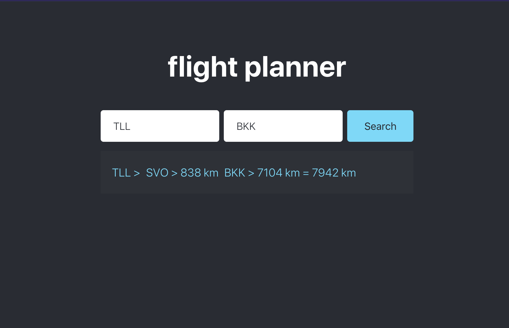

# Flight Planner
  
  Web app where one can search shortest route do he's desired destination.

  

# Setup

    1. docker compose up
    2. open browser http://localhost:80

# References
1. https://openflights.org/data.html
2. https://stackoverflow.com/questions/27928/calculate-distance-between-two-latitude-longitude-points-haversine-formula